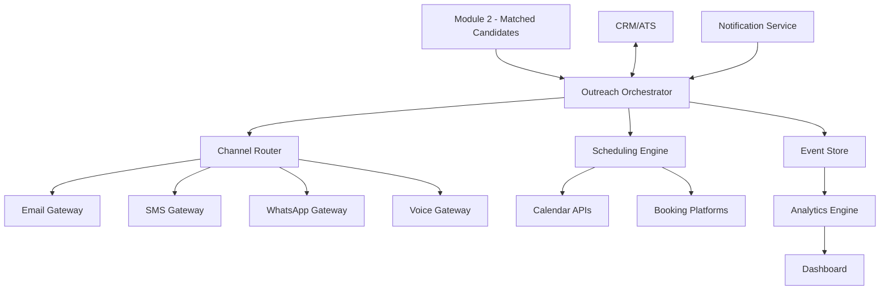

# Module 3: Candidate Outreach & Initial Interview Scheduling

## Table of Contents
1. [Introduction](#introduction)
2. [High-Level Architecture](#high-level-architecture)
3. [Data Sources & Prerequisites](#data-sources--prerequisites)
4. [Outreach Workflow](#outreach-workflow)
   - 4.1 [Multi-Channel Sequence](#multi-channel-sequence)
   - 4.2 [Dynamic Timing & Priority](#dynamic-timing--priority)
   - 4.3 [Retry Policy & Rate Limits](#retry-policy--rate-limits)
   - 4.4 [Channel Preference Learning](#channel-preference-learning)
5. [Message Templates & Contact Scripts](#message-templates--contact-scripts)
   - 5.1 [Email Templates](#email-templates)
   - 5.2 [SMS & WhatsApp](#sms--whatsapp)
   - 5.3 [Phone Call Script](#phone-call-script)
   - 5.4 [Template Personalization Engine](#template-personalization-engine)
6. [Integration Components](#integration-components)
   - 6.1 [Calendar & Scheduling Engine](#calendar--scheduling-engine)
   - 6.2 [Communication Gateways](#communication-gateways)
   - 6.3 [CRM/ATS Synchronization](#crmat-synchronization)
   - 6.4 [Logging & Analytics](#logging--analytics)
   - 6.5 [Event Sourcing & Audit Trail](#event-sourcing--audit-trail)
7. [Interview Scheduling Mechanics](#interview-scheduling-mechanics)
   - 7.1 [Smart Slot Discovery](#smart-slot-discovery)
   - 7.2 [Invite Generation & Delivery](#invite-generation--delivery)
   - 7.3 [Automated Reminders](#automated-reminders)
   - 7.4 [Conflict Resolution](#conflict-resolution)
8. [Data Models & APIs](#data-models--apis)
   - 8.1 [Core Data Models](#core-data-models)
   - 8.2 [REST API Specifications](#rest-api-specifications)
   - 8.3 [Webhook Events](#webhook-events)
9. [Monitoring & Reporting](#monitoring--reporting)
   - 9.1 [Real-Time Dashboard](#real-time-dashboard)
   - 9.2 [Alerts & Escalations](#alerts--escalations)
   - 9.3 [Advanced Analytics](#advanced-analytics)
   - 9.4 [A/B Testing Framework](#ab-testing-framework)
10. [Compliance & Best Practices](#compliance--best-practices)
   - 10.1 [Data Privacy & GDPR](#data-privacy--gdpr)
   - 10.2 [Consent & Opt-Out Management](#consent--opt-out-management)
   - 10.3 [Personalization & Tone](#personalization--tone)
   - 10.4 [Time Zone Handling](#time-zone-handling)
   - 10.5 [Accessibility & Inclusion](#accessibility--inclusion)
11. [Operational Considerations](#operational-considerations)
   - 11.1 [Error Handling & Retries](#error-handling--retries)
   - 11.2 [Scalability & Performance](#scalability--performance)
   - 11.3 [Security & Access Control](#security--access-control)
   - 11.4 [Disaster Recovery](#disaster-recovery)
12. [Configuration & Customization](#configuration--customization)
   - 12.1 [Business Rules Engine](#business-rules-engine)
   - 12.2 [Multi-Tenant Configuration](#multi-tenant-configuration)
   - 12.3 [Feature Flags](#feature-flags)
13. [Testing & Quality Assurance](#testing--quality-assurance)
   - 13.1 [Testing Strategy](#testing-strategy)
   - 13.2 [Test Automation](#test-automation)
   - 13.3 [Load Testing](#load-testing)
14. [Deployment & Infrastructure](#deployment--infrastructure)
   - 14.1 [Infrastructure Architecture](#infrastructure-architecture)
   - 14.2 [CI/CD Pipeline](#cicd-pipeline)
   - 14.3 [Monitoring & Observability](#monitoring--observability)
15. [Conclusion & Next Steps](#conclusion--next-steps)

---

## Introduction

Building on Module 2 (Job Matching), this module orchestrates candidate outreach across multiple channels (email, SMS, phone, WhatsApp, LinkedIn) and automates initial interview scheduling. The system employs intelligent channel selection, dynamic timing, and machine learning to optimize engagement rates while maintaining compliance and candidate experience.

**Key Objectives:**
- Transform pre-screened candidates into confirmed interview appointments
- Achieve >80% contact rate and >60% scheduling conversion
- Reduce time-to-schedule from 5 days to <24 hours
- Maintain GDPR compliance and candidate satisfaction

---

## High-Level Architecture

### System Overview


### Core Components

**Outreach Orchestrator** 
- Central coordination service managing campaign flows
- Event-driven architecture with async processing
- State machine for tracking candidate journey stages

**Channel Router**
- Intelligent channel selection based on candidate preferences
- Load balancing across communication providers
- Failover mechanisms for service disruptions

**Scheduling Engine**
- Calendar integration with conflict resolution
- Smart slot optimization based on success rates
- Multi-timezone support with automatic conversion

**Event Store**
- Complete audit trail of all candidate interactions
- Event sourcing for state reconstruction
- Analytics data pipeline feeding

**Analytics Engine**
- Real-time metrics calculation
- Machine learning models for optimization
- Predictive analytics for success probability

### Technology Stack
- **Backend**: Node.js/TypeScript, Express.js, PostgreSQL, Redis
- **Message Queue**: Apache Kafka / AWS SQS
- **Cache**: Redis Cluster
- **APIs**: REST + GraphQL, OpenAPI 3.0 specs
- **Monitoring**: Prometheus, Grafana, ELK Stack
- **Infrastructure**: Kubernetes, Docker, AWS/Azure

---

## Data Sources & Prerequisites

### Input Data from Module 2
```json
{
  "candidateId": "uuid",
  "personalInfo": {
    "name": "string",
    "email": "string",
    "phone": "string",
    "whatsapp": "string",
    "linkedin": "string",
    "timezone": "string",
    "preferredLanguage": "string"
  },
  "jobMatch": {
    "jobId": "uuid",
    "role": "string",
    "company": "string",
    "matchScore": "number",
    "urgency": "low|medium|high|critical"
  },
  "preferences": {
    "preferredContactMethod": "string[]",
    "availabilityWindows": "object[]",
    "communicationStyle": "formal|casual|mixed"
  }
}
```

### HR Consultant Data
```json
{
  "consultantId": "uuid",
  "profile": {
    "name": "string",
    "email": "string",
    "phone": "string",
    "timezone": "string",
    "languages": "string[]"
  },
  "calendar": {
    "provider": "google|outlook|calendly",
    "accessToken": "encrypted_string",
    "workingHours": "object",
    "blackoutDates": "date[]"
  },
  "metrics": {
    "avgResponseTime": "duration",
    "successRate": "number",
    "specializations": "string[]"
  }
}
```

### System Configuration
- **Communication Providers**: SendGrid, Twilio, Meta Business API
- **Calendar Integrations**: Google Calendar, Outlook, Calendly, Acuity
- **CRM/ATS Systems**: Workday, BambooHR, Greenhouse, Lever

---

## Outreach Workflow

### 4.1 Multi-Channel Sequence

#### Standard Flow (Medium Priority)
1. **T+0**: Personalized email with scheduling link
2. **T+24h**: SMS reminder if no email engagement
3. **T+48h**: WhatsApp follow-up if no SMS response
4. **T+72h**: LinkedIn connection request (if available)
5. **T+96h**: Escalate to manual phone call
6. **T+120h**: Final automated email before archiving

#### High Priority Flow
1. **T+0**: Simultaneous email + SMS
2. **T+4h**: WhatsApp if no response
3. **T+8h**: Direct phone call attempt
4. **T+12h**: LinkedIn outreach
5. **T+24h**: Escalate to senior recruiter

#### Critical Priority Flow
1. **T+0**: Direct phone call + email
2. **T+1h**: SMS + WhatsApp if call unsuccessful
3. **T+2h**: Second phone call attempt
4. **T+4h**: Manager escalation

### 4.2 Dynamic Timing & Priority

**Urgency-Based Scheduling**
```javascript
const getOutreachTiming = (urgency, candidateProfile) => {
  const baseIntervals = {
    low: [0, 48, 96, 168], // hours
    medium: [0, 24, 48, 72],
    high: [0, 4, 8, 12],
    critical: [0, 1, 2, 4]
  };
  
  // Adjust based on candidate's historical response patterns
  return adjustForCandidatePattern(baseIntervals[urgency], candidateProfile);
};
```

**Business Hours Optimization**
- Respect candidate's timezone and working hours
- Optimize send times based on channel effectiveness
- Weekend/holiday handling per locale

### 4.3 Retry Policy & Rate Limits

**Channel-Specific Limits**
- Email: 100/hour per domain
- SMS: 50/hour per number (carrier limits)
- WhatsApp: 1000/24h per business account
- Phone: 20 attempts/day per number

**Exponential Backoff**
```javascript
const retryConfig = {
  maxAttempts: 3,
  baseDelay: 1000, // ms
  maxDelay: 30000,
  backoffFactor: 2,
  jitter: true
};
```

### 4.4 Channel Preference Learning

**ML-Based Channel Selection**
- Historical response rates by demographic
- Time-of-day optimization per channel
- Industry/role-specific preferences
- Continuous A/B testing and optimization

---

## Message Templates & Contact Scripts

### 5.1 Email Templates

#### Professional/Senior Roles
```html
Subject: Interview Opportunity - {{role}} at {{company}}

Dear {{candidateName}},

I hope this message finds you well. I'm reaching out regarding an exciting {{role}} opportunity at {{company}} that aligns perfectly with your background in {{candidateExpertise}}.

**Role Highlights:**
• {{roleHighlight1}}
• {{roleHighlight2}}
• {{roleHighlight3}}

**Next Steps:**
I'd love to discuss this opportunity with you in a brief 20-minute conversation. Please select a time that works best for you:

{{schedulingLink}}

If these times don't work, feel free to reply with your availability, and I'll accommodate your schedule.

Best regards,
{{consultantName}}
{{consultantTitle}}
{{company}}
{{consultantPhone}} | {{consultantEmail}}
```

#### Mid-Level/Technical Roles
```html
Subject: {{role}} Interview - {{company}} is interested!

Hi {{candidateName}},

Great news! {{company}} would like to interview you for the {{role}} position. 

Your experience with {{keySkill1}} and {{keySkill2}} caught their attention, especially {{specificAchievement}}.

**Quick Details:**
• Role: {{role}}
• Team: {{teamName}}
• Interview: 30-minute video call
• Next step: Technical discussion with the hiring manager

Ready to chat? Pick your preferred time:
{{schedulingLink}}

Questions? Just reply to this email.

Cheers,
{{consultantName}}
```

### 5.2 SMS & WhatsApp

#### SMS Template
```
Hi {{firstName}}, this is {{consultantName}} from {{company}}. 

Exciting {{role}} opportunity! 

Book interview: {{shortLink}}

Questions? Call {{consultantPhone}}
```

#### WhatsApp Template
```
Hello {{firstName}}! 👋

I'm {{consultantName}} from {{company}}. We're impressed with your profile and would love to chat about a {{role}} position.

🎯 Perfect match for your {{keySkill}} experience
⏰ Just 20 minutes of your time
🔗 Easy booking: {{schedulingLink}}

Let me know if you have any questions!
```

### 5.3 Phone Call Script

#### Opening (First 30 seconds)
```
"Hi {{candidateName}}, this is {{consultantName}} from {{company}}. 

I hope I'm not catching you at a bad time? I'm calling about an exciting {{role}} opportunity that matches your background perfectly.

Do you have 2-3 minutes for me to share some quick details?"

[If yes, continue. If no, schedule callback]
```

#### Pitch (60 seconds)
```
"Excellent! So we have a {{role}} position at {{company}} - {{companyDescription}}. 

What caught our attention about your profile was {{specificSkill/achievement}}. The role involves {{keyResponsibility1}}, {{keyResponsibility2}}, and {{keyResponsibility3}}.

The hiring manager is particularly excited to meet candidates with your {{expertise}} background."
```

#### Scheduling (30 seconds)
```
"I'd love to set up a brief 20-minute conversation where we can dive deeper into the opportunity and answer any questions you might have.

I have availability {{timeSlot1}}, {{timeSlot2}}, or {{timeSlot3}}. Which works better for you?"

[Confirm details, send calendar invite immediately]
```

### 5.4 Template Personalization Engine

**Dynamic Content Generation**
```javascript
const personalizeTemplate = async (template, candidate, job) => {
  const context = await buildPersonalizationContext(candidate, job);
  
  return {
    subject: await renderTemplate(template.subject, context),
    body: await renderTemplate(template.body, context),
    metadata: {
      personalizations: context.personalizations,
      tone: detectOptimalTone(candidate),
      urgency: calculateUrgencyLevel(job)
    }
  };
};
```

**AI-Powered Content Optimization**
- GPT-4 integration for dynamic content generation
- Sentiment analysis for tone adjustment
- Cultural adaptation for international candidates

---

## Integration Components

### 6.1 Calendar & Scheduling Engine

#### Smart Availability Detection
```javascript
class SchedulingEngine {
  async getOptimalSlots(consultantId, candidateTimezone, preferences = {}) {
    const consultant = await this.getConsultant(consultantId);
    const baseAvailability = await this.getCalendarAvailability(consultant);
    
    // Apply business rules
    const businessHours = this.applyBusinessHours(baseAvailability, candidateTimezone);
    const optimizedSlots = await this.optimizeSlotsBySuccessRate(businessHours);
    
    // Respect candidate preferences
    return this.filterByPreferences(optimizedSlots, preferences);
  }
  
  async optimizeSlotsBySuccessRate(slots) {
    // ML model predicting slot success based on historical data
    const predictions = await this.mlService.predictSlotSuccess(slots);
    return slots
      .map((slot, index) => ({ ...slot, successScore: predictions[index] }))
      .sort((a, b) => b.successScore - a.successScore)
      .slice(0, 5); // Top 5 slots
  }
}
```

#### Multi-Calendar Integration
```javascript
const calendarProviders = {
  google: new GoogleCalendarAdapter(),
  outlook: new OutlookCalendarAdapter(),
  calendly: new CalendlyAdapter(),
  acuity: new AcuityAdapter()
};

class CalendarService {
  async createInterview(consultantId, candidateEmail, slot) {
    const consultant = await this.getConsultant(consultantId);
    const provider = calendarProviders[consultant.calendarProvider];
    
    const event = {
      title: `Interview - ${candidate.name} - ${job.title}`,
      start: slot.start,
      end: slot.end,
      attendees: [consultant.email, candidateEmail],
      location: await this.generateMeetingLink(),
      description: this.generateInterviewDescription(candidate, job)
    };
    
    return await provider.createEvent(event);
  }
}
```

### 6.2 Communication Gateways

#### Email Service (SendGrid Integration)
```javascript
class EmailService {
  async sendPersonalizedEmail(to, template, context) {
    const personalizedContent = await this.personalizationEngine.render(template, context);
    
    const message = {
      to: to,
      from: { email: context.consultant.email, name: context.consultant.name },
      subject: personalizedContent.subject,
      html: personalizedContent.body,
      trackingSettings: {
        clickTracking: { enable: true },
        openTracking: { enable: true }
      },
      customArgs: {
        candidateId: context.candidate.id,
        campaignId: context.campaign.id,
        jobId: context.job.id
      }
    };
    
    return await this.sendgrid.send(message);
  }
}
```

#### SMS/WhatsApp Service (Twilio Integration)
```javascript
class MessagingService {
  async sendSMS(to, message, context) {
    // Validate opt-in status
    if (!await this.hasOptInConsent(to, 'sms')) {
      throw new Error('SMS consent required');
    }
    
    return await this.twilio.messages.create({
      body: message,
      to: to,
      from: this.smsNumber,
      statusCallback: `${this.webhookUrl}/sms/status`,
      validityPeriod: 14400 // 4 hours
    });
  }
  
  async sendWhatsApp(to, template, context) {
    if (!await this.hasOptInConsent(to, 'whatsapp')) {
      throw new Error('WhatsApp consent required');
    }
    
    return await this.twilio.messages.create({
      body: await this.renderTemplate(template, context),
      to: `whatsapp:${to}`,
      from: `whatsapp:${this.whatsappNumber}`,
      statusCallback: `${this.webhookUrl}/whatsapp/status`
    });
  }
}
```

### 6.3 CRM/ATS Synchronization

#### Real-Time Status Updates
```javascript
class CRMSyncService {
  async updateCandidateStatus(candidateId, status, metadata = {}) {
    const candidate = await this.getCandidateById(candidateId);
    
    // Update internal state
    await this.candidateRepository.updateStatus(candidateId, status, {
      ...metadata,
      timestamp: new Date(),
      updatedBy: 'outreach-system'
    });
    
    // Sync to external CRM/ATS
    await this.syncToExternalSystems(candidate, status, metadata);
    
    // Trigger webhooks for downstream systems
    await this.eventBus.publish('candidate.status.updated', {
      candidateId,
      status,
      metadata
    });
  }
  
  async syncToExternalSystems(candidate, status, metadata) {
    const systems = await this.getActiveCRMSystems();
    
    await Promise.allSettled(
      systems.map(system => 
        this.crmAdapters[system.type].updateCandidate(candidate, status, metadata)
      )
    );
  }
}
```

### 6.4 Logging & Analytics

#### Structured Logging
```javascript
class AnalyticsService {
  async trackOutreachEvent(event) {
    const enrichedEvent = {
      ...event,
      timestamp: new Date().toISOString(),
      sessionId: this.generateSessionId(),
      userId: event.candidateId,
      properties: {
        ...event.properties,
        channel: event.channel,
        templateId: event.templateId,
        consultantId: event.consultantId
      }
    };
    
    // Real-time analytics
    await this.analyticsQueue.add('track-event', enrichedEvent);
    
    // Long-term storage
    await this.eventStore.append(enrichedEvent);
    
    // Update metrics
    await this.metricsService.updateCounters(enrichedEvent);
  }
}
```

### 6.5 Event Sourcing & Audit Trail

#### Event Store Implementation
```javascript
class EventStore {
  async append(streamId, events) {
    const eventStream = events.map(event => ({
      streamId,
      eventId: uuidv4(),
      eventType: event.type,
      eventData: event.data,
      metadata: event.metadata || {},
      timestamp: new Date(),
      version: await this.getNextVersion(streamId)
    }));
    
    await this.db.transaction(async (trx) => {
      await trx('events').insert(eventStream);
      await this.updateSnapshot(trx, streamId, eventStream);
    });
    
    // Publish events to message bus
    await this.eventBus.publishBatch(eventStream);
  }
  
  async getEvents(streamId, fromVersion = 0) {
    return await this.db('events')
      .where({ streamId })
      .where('version', '>', fromVersion)
      .orderBy('version', 'asc');
  }
}
```

---

## Interview Scheduling Mechanics

### 7.1 Smart Slot Discovery

#### ML-Enhanced Availability
```javascript
class SmartScheduler {
  async discoverOptimalSlots(consultantId, candidateProfile, jobUrgency) {
    // Get base availability
    const rawSlots = await this.getCalendarAvailability(consultantId);
    
    // Apply business rules
    const businessSlots = this.filterBusinessHours(rawSlots, candidateProfile.timezone);
    
    // ML optimization
    const scoredSlots = await this.scoreSlotsBySuccessProbability(
      businessSlots, 
      candidateProfile, 
      jobUrgency
    );
    
    // Rank by multiple factors
    return this.rankSlots(scoredSlots, {
      successProbability: 0.4,
      consultantPreference: 0.3,
      candidateTimezone: 0.2,
      urgency: 0.1
    });
  }
  
  async scoreSlotsBySuccessProbability(slots, candidateProfile, urgency) {
    const features = slots.map(slot => this.extractFeatures(slot, candidateProfile));
    const predictions = await this.mlModel.predict(features);
    
    return slots.map((slot, index) => ({
      ...slot,
      successScore: predictions[index],
      features: features[index]
    }));
  }
}
```

### 7.2 Invite Generation & Delivery

#### Rich Calendar Invites
```javascript
class InviteGenerator {
  async createInterviewInvite(interview) {
    const meetingDetails = {
      title: `${interview.job.title} Interview - ${interview.candidate.name}`,
      description: await this.generateDescription(interview),
      start: interview.slot.start,
      end: interview.slot.end,
      timezone: interview.consultant.timezone,
      location: interview.meetingLink,
      attachments: await this.generateAttachments(interview)
    };
    
    // Generate ICS file
    const icsContent = this.generateICS(meetingDetails);
    
    // Create in consultant's calendar
    await this.calendarService.createEvent(interview.consultant.id, meetingDetails);
    
    // Send to candidate
    await this.emailService.sendInvite(interview.candidate.email, {
      icsAttachment: icsContent,
      htmlBody: await this.renderInviteEmail(interview),
      trackingPixel: this.generateTrackingPixel(interview.id)
    });
    
    return { success: true, inviteId: interview.id };
  }
  
  async generateDescription(interview) {
    return `
Interview Details:
• Position: ${interview.job.title}
• Company: ${interview.job.company}
• Duration: 30 minutes
• Format: Video call

Meeting Link: ${interview.meetingLink}
Dial-in: ${interview.dialIn}

Preparation:
• Review job description: ${interview.job.link}
• Prepare questions about the role
• Test your video/audio setup

Contact: ${interview.consultant.name} - ${interview.consultant.email}
    `.trim();
  }
}
```

### 7.3 Automated Reminders

#### Smart Reminder System
```javascript
class ReminderService {
  async scheduleReminders(interviewId) {
    const interview = await this.getInterview(interviewId);
    const reminderTimes = this.calculateReminderTimes(interview);
    
    for (const reminderTime of reminderTimes) {
      await this.scheduler.schedule({
        jobId: `reminder-${interviewId}-${reminderTime.type}`,
        runAt: reminderTime.timestamp,
        payload: {
          interviewId,
          reminderType: reminderTime.type,
          channel: reminderTime.channel
        }
      });
    }
  }
  
  calculateReminderTimes(interview) {
    const interviewTime = new Date(interview.scheduledAt);
    const reminders = [];
    
    // 24-hour email reminder
    reminders.push({
      type: '24h',
      channel: 'email',
      timestamp: new Date(interviewTime.getTime() - 24 * 60 * 60 * 1000)
    });
    
    // 1-hour SMS reminder (if opted in)
    if (interview.candidate.smsOptIn) {
      reminders.push({
        type: '1h',
        channel: 'sms',
        timestamp: new Date(interviewTime.getTime() - 60 * 60 * 1000)
      });
    }
    
    return reminders;
  }
}
```

### 7.4 Conflict Resolution

#### Automatic Rescheduling
```javascript
class ConflictResolver {
  async handleCalendarConflict(interviewId, conflictEvent) {
    const interview = await this.getInterview(interviewId);
    
    // Find alternative slots
    const alternativeSlots = await this.smartScheduler.findAlternativeSlots(
      interview.consultantId,
      interview.originalSlot,
      { maxDaysOffset: 3, preferSameTimeOfDay: true }
    );
    
    if (alternativeSlots.length === 0) {
      return await this.escalateToHuman(interviewId, 'no_alternative_slots');
    }
    
    // Auto-reschedule if candidate preference allows
    if (interview.candidate.autoRescheduleConsent) {
      const newSlot = alternativeSlots[0];
      return await this.rescheduleInterview(interviewId, newSlot);
    }
    
    // Otherwise, offer options to candidate
    return await this.offerRescheduleOptions(interviewId, alternativeSlots);
  }
}
```

---

## Data Models & APIs

### 8.1 Core Data Models

#### Candidate Model
```typescript
interface Candidate {
  id: string;
  personalInfo: {
    firstName: string;
    lastName: string;
    email: string;
    phone?: string;
    whatsapp?: string;
    linkedin?: string;
    timezone: string;
    preferredLanguage: string;
  };
  preferences: {
    contactMethods: ContactMethod[];
    availabilityWindows: AvailabilityWindow[];
    communicationStyle: 'formal' | 'casual' | 'mixed';
    autoRescheduleConsent: boolean;
  };
  consent: {
    email: ConsentRecord;
    sms: ConsentRecord;
    whatsapp: ConsentRecord;
    calls: ConsentRecord;
  };
  history: {
    interactions: Interaction[];
    responses: ResponseHistory;
    preferences: PreferenceHistory;
  };
  status: CandidateStatus;
  createdAt: Date;
  updatedAt: Date;
}

interface ConsentRecord {
  granted: boolean;
  timestamp: Date;
  source: string;
  ipAddress?: string;
}

interface Interaction {
  id: string;
  type: 'email' | 'sms' | 'whatsapp' | 'call' | 'meeting';
  direction: 'outbound' | 'inbound';
  timestamp: Date;
  content?: string;
  metadata: Record<string, any>;
  outcome: InteractionOutcome;
}
```

#### Interview Model
```typescript
interface Interview {
  id: string;
  candidateId: string;
  consultantId: string;
  jobId: string;
  status: InterviewStatus;
  scheduledAt: Date;
  duration: number; // minutes
  timezone: string;
  format: 'phone' | 'video' | 'in-person';
  meetingLink?: string;
  location?: string;
  agenda: string[];
  reminders: ReminderSchedule[];
  feedback?: InterviewFeedback;
  recordings?: Recording[];
  createdAt: Date;
  updatedAt: Date;
}

enum InterviewStatus {
  SCHEDULED = 'scheduled',
  CONFIRMED = 'confirmed',
  RESCHEDULED = 'rescheduled',
  CANCELLED = 'cancelled',
  COMPLETED = 'completed',
  NO_SHOW = 'no_show'
}
```

#### Campaign Model
```typescript
interface OutreachCampaign {
  id: string;
  name: string;
  candidateIds: string[];
  status: CampaignStatus;
  config: {
    channels: ChannelConfig[];
    timing: TimingConfig;
    templates: TemplateConfig[];
    rules: BusinessRule[];
  };
  metrics: CampaignMetrics;
  createdBy: string;
  createdAt: Date;
  startedAt?: Date;
  completedAt?: Date;
}
```

### 8.2 REST API Specifications

#### Candidates API
```yaml
/api/v1/candidates:
  post:
    summary: Create or update candidate
    requestBody:
      content:
        application/json:
          schema:
            $ref: '#/components/schemas/Candidate'
    responses:
      201:
        description: Candidate created
      200:
        description: Candidate updated

  get:
    summary: List candidates
    parameters:
      - name: status
        in: query
        schema:
          type: string
          enum: [active, contacted, scheduled, archived]
      - name: limit
        in: query
        schema:
          type: integer
          default: 50
      - name: offset
        in: query
        schema:
          type: integer
          default: 0

/api/v1/candidates/{candidateId}/outreach:
  post:
    summary: Start outreach campaign
    requestBody:
      content:
        application/json:
          schema:
            type: object
            properties:
              priority:
                type: string
                enum: [low, medium, high, critical]
              channels:
                type: array
                items:
                  type: string
              customMessage:
                type: string
```

#### Scheduling API
```yaml
/api/v1/interviews:
  post:
    summary: Schedule interview
    requestBody:
      content:
        application/json:
          schema:
            type: object
            properties:
              candidateId:
                type: string
              consultantId:
                type: string
              jobId:
                type: string
              preferredSlots:
                type: array
                items:
                  $ref: '#/components/schemas/TimeSlot'

/api/v1/consultants/{consultantId}/availability:
  get:
    summary: Get consultant availability
    parameters:
      - name: startDate
        in: query
        schema:
          type: string
          format: date
      - name: endDate
        in: query
        schema:
          type: string
          format: date
      - name: timezone
        in: query
        schema:
          type: string
    responses:
      200:
        description: Available time slots
        content:
          application/json:
            schema:
              type: array
              items:
                $ref: '#/components/schemas/TimeSlot'
```

### 8.3 Webhook Events

#### Event Types
```typescript
interface WebhookEvent {
  id: string;
  type: WebhookEventType;
  timestamp: Date;
  data: Record<string, any>;
  signature: string;
}

enum WebhookEventType {
  // Outreach events
  EMAIL_SENT = 'outreach.email.sent',
  EMAIL_OPENED = 'outreach.email.opened',
  EMAIL_CLICKED = 'outreach.email.clicked',
  SMS_SENT = 'outreach.sms.sent',
  SMS_REPLIED = 'outreach.sms.replied',
  
  // Scheduling events
  INTERVIEW_SCHEDULED = 'interview.scheduled',
  INTERVIEW_CONFIRMED = 'interview.confirmed',
  INTERVIEW_RESCHEDULED = 'interview.rescheduled',
  INTERVIEW_CANCELLED = 'interview.cancelled',
  
  // System events
  CANDIDATE_STATUS_CHANGED = 'candidate.status.changed',
  CAMPAIGN_COMPLETED = 'campaign.completed'
}
```

---

## Monitoring & Reporting

### 9.1 Real-Time Dashboard

#### Key Performance Indicators
```typescript
interface DashboardMetrics {
  realTime: {
    activeOutreachCampaigns: number;
    pendingInterviews: number;
    todayScheduled: number;
    systemHealth: SystemHealth;
  };
  
  performance: {
    contactRate: {
      current: number;
      target: number;
      trend: 'up' | 'down' | 'stable';
    };
    
    responseRate: {
      email: number;
      sms: number;
      whatsapp: number;
      phone: number;
    };
    
    conversionRate: {
      contactToScheduled: number;
      scheduledToCompleted: number;
      avgTimeToSchedule: number; // hours
    };
  };
  
  channelEffectiveness: {
    [channel: string]: {
      sentCount: number;
      responseCount: number;
      conversionCount: number;
      avgResponseTime: number;
      cost: number;
      roi: number;
    };
  };
}
```

### 9.2 Alerts & Escalations

#### Alert Configuration
```javascript
const alertRules = [
  {
    name: 'Low Email Delivery Rate',
    condition: 'email_delivery_rate < 0.95',
    threshold: '5min',
    severity: 'warning',
    actions: ['email_admin', 'slack_channel']
  },
  {
    name: 'High SMS Failure Rate',
    condition: 'sms_failure_rate > 0.1',
    threshold: '1min',
    severity: 'critical',
    actions: ['page_oncall', 'switch_provider']
  },
  {
    name: 'Interview No-Show Rate',
    condition: 'no_show_rate > 0.3',
    threshold: '1day',
    severity: 'warning',
    actions: ['notify_recruiters', 'review_reminder_strategy']
  }
];

class AlertingService {
  async evaluateRules() {
    const metrics = await this.metricsService.getCurrentMetrics();
    
    for (const rule of alertRules) {
      if (this.evaluateCondition(rule.condition, metrics)) {
        await this.triggerAlert(rule);
      }
    }
  }
}
```

### 9.3 Advanced Analytics

#### Predictive Analytics
```javascript
class PredictiveAnalytics {
  async predictCandidateEngagement(candidateId, jobId) {
    const candidate = await this.getCandidateProfile(candidateId);
    const features = this.extractFeatures(candidate, jobId);
    
    return {
      engagementProbability: await this.mlModels.engagement.predict(features),
      preferredChannel: await this.mlModels.channelPreference.predict(features),
      optimalContactTime: await this.mlModels.timing.predict(features),
      expectedResponseTime: await this.mlModels.responseTime.predict(features)
    };
  }
  
  async optimizeCampaignSequence(candidates, job) {
    const predictions = await Promise.all(
      candidates.map(c => this.predictCandidateEngagement(c.id, job.id))
    );
    
    return this.generateOptimalSequence(candidates, predictions);
  }
}
```

### 9.4 A/B Testing Framework

#### Template Testing
```javascript
class ABTestService {
  async createEmailTemplateTest(testConfig) {
    const test = {
      id: uuidv4(),
      name: testConfig.name,
      hypothesis: testConfig.hypothesis,
      variants: testConfig.variants,
      trafficSplit: testConfig.trafficSplit || [0.5, 0.5],
      successMetric: testConfig.successMetric,
      duration: testConfig.duration,
      status: 'active'
    };
    
    await this.testRepository.create(test);
    return test;
  }
  
  async getVariantForCandidate(testId, candidateId) {
    const test = await this.getTest(testId);
    const hash = this.hashCandidateId(candidateId);
    const bucket = hash % 100;
    
    let cumulativeTraffic = 0;
    for (let i = 0; i < test.trafficSplit.length; i++) {
      cumulativeTraffic += test.trafficSplit[i] * 100;
      if (bucket < cumulativeTraffic) {
        return test.variants[i];
      }
    }
    
    return test.variants[0]; // fallback
  }
}
```

---

## Compliance & Best Practices

### 10.1 Data Privacy & GDPR

#### Privacy by Design
```javascript
class PrivacyService {
  async processPersonalData(data, purpose, legalBasis) {
    // Validate legal basis
    this.validateLegalBasis(legalBasis, purpose);
    
    // Data minimization
    const minimizedData = this.minimizeData(data, purpose);
    
    // Encrypt sensitive fields
    const encryptedData = await this.encryptPII(minimizedData);
    
    // Log processing activity
    await this.auditLogger.log({
      action: 'process_personal_data',
      purpose,
      legalBasis,
      dataSubject: data.id,
      timestamp: new Date()
    });
    
    return encryptedData;
  }
  
  async handleDataSubjectRequest(request) {
    switch (request.type) {
      case 'access':
        return await this.generateDataExport(request.subjectId);
      case 'rectification':
        return await this.updatePersonalData(request.subjectId, request.corrections);
      case 'erasure':
        return await this.deletePersonalData(request.subjectId);
      case 'portability':
        return await this.exportDataPortable(request.subjectId);
      default:
        throw new Error(`Unsupported request type: ${request.type}`);
    }
  }
}
```

### 10.2 Consent & Opt-Out Management

#### Granular Consent System
```javascript
class ConsentManager {
  async recordConsent(candidateId, consentData) {
    const consent = {
      candidateId,
      consentType: consentData.type,
      granted: consentData.granted,
      timestamp: new Date(),
      source: consentData.source,
      ipAddress: consentData.ipAddress,
      userAgent: consentData.userAgent,
      doubleOptIn: consentData.doubleOptIn || false
    };
    
    await this.consentRepository.create(consent);
    
    // Update candidate communication preferences
    await this.updateCommunicationPreferences(candidateId, consent);
    
    return consent;
  }
  
  async processOptOut(candidateId, channel, source) {
    // Record opt-out
    await this.recordConsent(candidateId, {
      type: channel,
      granted: false,
      source: source,
      timestamp: new Date()
    });
    
    // Cancel pending communications
    await this.cancelPendingCommunications(candidateId, channel);
    
    // Add to suppression list
    await this.addToSuppressionList(candidateId, channel);
    
    // Notify relevant services
    await this.eventBus.publish('candidate.opted_out', {
      candidateId,
      channel,
      timestamp: new Date()
    });
  }
}
```

### 10.3 Personalization & Tone

#### Cultural Adaptation Engine
```javascript
class CulturalAdaptationService {
  async adaptMessageForCandidate(message, candidate) {
    const culturalContext = await this.getCulturalContext(candidate);
    
    return {
      tone: this.adaptTone(message.tone, culturalContext),
      formality: this.adaptFormality(message.formality, culturalContext),
      content: await this.adaptContent(message.content, culturalContext),
      timing: this.adaptTiming(message.timing, culturalContext)
    };
  }
  
  getCulturalContext(candidate) {
    return {
      country: candidate.personalInfo.country,
      language: candidate.personalInfo.preferredLanguage,
      industry: candidate.industry,
      seniority: candidate.seniority,
      communicationStyle: candidate.preferences.communicationStyle
    };
  }
}
```

### 10.4 Time Zone Handling

#### Smart Time Zone Management
```javascript
class TimeZoneService {
  async optimizeMessageTiming(candidateId, messageType) {
    const candidate = await this.getCandidateById(candidateId);
    const timezone = candidate.personalInfo.timezone;
    
    // Get optimal send times for this timezone and message type
    const optimalTimes = await this.getOptimalSendTimes(timezone, messageType);
    
    // Consider candidate's historical engagement patterns
    const personalOptimalTimes = await this.getPersonalOptimalTimes(candidateId);
    
    // Combine global and personal optimization
    return this.combineOptimalTimes(optimalTimes, personalOptimalTimes);
  }
  
  async convertToLocalTime(utcTime, timezone) {
    return moment.tz(utcTime, timezone).format('YYYY-MM-DD HH:mm:ss z');
  }
}
```

### 10.5 Accessibility & Inclusion

#### Inclusive Communication
```javascript
class InclusivityService {
  async reviewMessageForInclusivity(message) {
    const issues = [];
    
    // Check for biased language
    const biasIssues = await this.detectBias(message.content);
    issues.push(...biasIssues);
    
    // Check accessibility
    const accessibilityIssues = this.checkAccessibility(message);
    issues.push(...accessibilityIssues);
    
    // Suggest improvements
    const suggestions = await this.generateSuggestions(message, issues);
    
    return {
      score: this.calculateInclusivityScore(issues),
      issues,
      suggestions,
      approved: issues.length === 0
    };
  }
}
```

---

## Operational Considerations

### 11.1 Error Handling & Retries

#### Resilient Error Handling
```javascript
class ResilientOperations {
  async executeWithRetry(operation, config = {}) {
    const {
      maxAttempts = 3,
      baseDelay = 1000,
      maxDelay = 30000,
      backoffFactor = 2,
      retryableErrors = ['TIMEOUT', 'CONNECTION_ERROR', 'RATE_LIMIT']
    } = config;
    
    let lastError;
    
    for (let attempt = 1; attempt <= maxAttempts; attempt++) {
      try {
        return await operation();
      } catch (error) {
        lastError = error;
        
        if (!this.isRetryableError(error, retryableErrors) || 
            attempt === maxAttempts) {
          throw error;
        }
        
        const delay = Math.min(
          baseDelay * Math.pow(backoffFactor, attempt - 1),
          maxDelay
        );
        
        await this.sleep(delay + Math.random() * 1000); // Add jitter
      }
    }
    
    throw lastError;
  }
  
  async handleCircuitBreaker(serviceName, operation) {
    const circuit = this.circuitBreakers[serviceName];
    
    if (circuit.isOpen()) {
      throw new Error(`Circuit breaker open for ${serviceName}`);
    }
    
    try {
      const result = await operation();
      circuit.recordSuccess();
      return result;
    } catch (error) {
      circuit.recordFailure();
      throw error;
    }
  }
}
```

### 11.2 Scalability & Performance

#### Auto-Scaling Configuration
```yaml
# Kubernetes HPA configuration
apiVersion: autoscaling/v2
kind: HorizontalPodAutoscaler
metadata:
  name: outreach-service-hpa
spec:
  scaleTargetRef:
    apiVersion: apps/v1
    kind: Deployment
    name: outreach-service
  minReplicas: 3
  maxReplicas: 50
  metrics:
  - type: Resource
    resource:
      name: cpu
      target:
        type: Utilization
        averageUtilization: 70
  - type: Resource
    resource:
      name: memory
      target:
        type: Utilization
        averageUtilization: 80
  behavior:
    scaleUp:
      stabilizationWindowSeconds: 60
      policies:
      - type: Percent
        value: 100
        periodSeconds: 15
    scaleDown:
      stabilizationWindowSeconds: 300
      policies:
      - type: Percent
        value: 10
        periodSeconds: 60
```

#### Performance Optimization
```javascript
class PerformanceOptimizer {
  async optimizeMessageBatching() {
    // Batch messages by provider to reduce API calls
    const batches = await this.groupMessagesByProvider();
    
    return Promise.all(
      batches.map(batch => this.sendBatch(batch))
    );
  }
  
  async implementCaching() {
    // Cache frequently accessed data
    await this.redis.pipeline()
      .setex('candidate:templates', 3600, JSON.stringify(templates))
      .setex('consultant:availability', 300, JSON.stringify(availability))
      .exec();
  }
  
  async optimizeDatabase() {
    // Use read replicas for analytics queries
    const analyticsQueries = this.getAnalyticsQueries();
    return this.readReplica.query(analyticsQueries);
  }
}
```

### 11.3 Security & Access Control

#### Authentication & Authorization
```javascript
class SecurityService {
  async authenticateRequest(request) {
    const token = this.extractToken(request);
    const payload = await this.validateJWT(token);
    
    // Check token expiry and blacklist
    if (await this.isTokenBlacklisted(token)) {
      throw new UnauthorizedError('Token has been revoked');
    }
    
    return payload;
  }
  
  async authorizeAction(user, resource, action) {
    const permissions = await this.getUserPermissions(user.id);
    
    return this.rbac.check(permissions, resource, action);
  }
  
  async encryptSensitiveData(data) {
    const sensitiveFields = ['email', 'phone', 'personalInfo'];
    
    for (const field of sensitiveFields) {
      if (data[field]) {
        data[field] = await this.encryption.encrypt(data[field]);
      }
    }
    
    return data;
  }
}
```

### 11.4 Disaster Recovery

#### Backup and Recovery Strategy
```javascript
class DisasterRecoveryService {
  async createBackup() {
    const backup = {
      timestamp: new Date(),
      data: {
        candidates: await this.exportCandidates(),
        interviews: await this.exportInterviews(),
        campaigns: await this.exportCampaigns(),
        events: await this.exportEvents()
      }
    };
    
    // Store in multiple locations
    await Promise.all([
      this.s3.putObject({ Bucket: 'backups-primary', Key: `backup-${backup.timestamp}`, Body: JSON.stringify(backup) }),
      this.gcs.bucket('backups-secondary').file(`backup-${backup.timestamp}`).save(JSON.stringify(backup))
    ]);
    
    return backup;
  }
  
  async restoreFromBackup(backupId) {
    const backup = await this.loadBackup(backupId);
    
    // Restore in specific order to maintain referential integrity
    await this.restoreCandidates(backup.data.candidates);
    await this.restoreInterviews(backup.data.interviews);
    await this.restoreCampaigns(backup.data.campaigns);
    await this.restoreEvents(backup.data.events);
    
    await this.validateDataIntegrity();
  }
}
```

---

## Configuration & Customization

### 12.1 Business Rules Engine

#### Dynamic Rule Configuration
```javascript
class BusinessRulesEngine {
  constructor() {
    this.rules = new Map();
    this.loadRules();
  }
  
  async evaluateRule(ruleName, context) {
    const rule = this.rules.get(ruleName);
    if (!rule) {
      throw new Error(`Rule not found: ${ruleName}`);
    }
    
    return await rule.evaluate(context);
  }
  
  async loadRules() {
    const rules = await this.rulesRepository.getActiveRules();
    
    for (const ruleConfig of rules) {
      const rule = new Rule(ruleConfig);
      this.rules.set(ruleConfig.name, rule);
    }
  }
}

// Example rule configuration
const outreachTimingRule = {
  name: 'outreach_timing',
  conditions: [
    {
      field: 'candidate.timezone',
      operator: 'equals',
      value: 'America/New_York'
    },
    {
      field: 'job.urgency',
      operator: 'equals',
      value: 'high'
    }
  ],
  actions: [
    {
      type: 'set_timing',
      params: { intervals: [0, 2, 4, 8] } // hours
    }
  ]
};
```

### 12.2 Multi-Tenant Configuration

#### Tenant-Specific Settings
```javascript
class TenantConfigService {
  async getTenantConfig(tenantId) {
    const defaultConfig = await this.getDefaultConfig();
    const tenantOverrides = await this.getTenantOverrides(tenantId);
    
    return this.mergeConfigs(defaultConfig, tenantOverrides);
  }
  
  async updateTenantConfig(tenantId, updates) {
    const currentConfig = await this.getTenantConfig(tenantId);
    const newConfig = { ...currentConfig, ...updates };
    
    // Validate configuration
    await this.validateConfig(newConfig);
    
    // Save and apply
    await this.saveTenantConfig(tenantId, newConfig);
    await this.applyConfigChanges(tenantId, newConfig);
    
    return newConfig;
  }
}

// Example tenant configuration
const tenantConfig = {
  branding: {
    companyName: 'TechCorp',
    logoUrl: 'https://techcorp.com/logo.png',
    colors: {
      primary: '#007bff',
      secondary: '#6c757d'
    }
  },
  outreach: {
    channels: ['email', 'sms', 'whatsapp'],
    timing: {
      businessHours: { start: '09:00', end: '17:00' },
      timezone: 'America/New_York'
    },
    limits: {
      dailyEmails: 1000,
      dailySMS: 500
    }
  },
  compliance: {
    gdprEnabled: true,
    ccpaEnabled: true,
    consentRequired: ['sms', 'whatsapp']
  }
};
```

### 12.3 Feature Flags

#### Feature Flag Management
```javascript
class FeatureFlagService {
  async isFeatureEnabled(featureName, context = {}) {
    const flag = await this.getFeatureFlag(featureName);
    
    if (!flag || !flag.enabled) {
      return false;
    }
    
    // Evaluate targeting rules
    return await this.evaluateTargeting(flag, context);
  }
  
  async evaluateTargeting(flag, context) {
    for (const rule of flag.targetingRules) {
      if (await this.evaluateRule(rule, context)) {
        return rule.enabled;
      }
    }
    
    return flag.defaultValue;
  }
}

// Example feature flags
const featureFlags = {
  'ai-powered-personalization': {
    enabled: true,
    defaultValue: false,
    targetingRules: [
      {
        condition: 'tenantId in ["premium-1", "premium-2"]',
        enabled: true
      }
    ]
  },
  'whatsapp-outreach': {
    enabled: true,
    defaultValue: true,
    targetingRules: [
      {
        condition: 'candidate.country not in ["US", "CA"]',
        enabled: true
      }
    ]
  }
};
```

---

## Testing & Quality Assurance

### 13.1 Testing Strategy

#### Test Pyramid Implementation
```javascript
// Unit Tests
describe('OutreachService', () => {
  it('should select optimal channel based on candidate preferences', async () => {
    const candidate = { preferences: { contactMethods: ['email', 'sms'] } };
    const service = new OutreachService();
    
    const channel = await service.selectOptimalChannel(candidate);
    
    expect(channel).toBe('email'); // Email typically has higher success rate
  });
});

// Integration Tests
describe('Calendar Integration', () => {
  it('should sync with Google Calendar', async () => {
    const mockCalendar = new MockGoogleCalendar();
    const service = new CalendarService(mockCalendar);
    
    const availability = await service.getAvailability('consultant-1');
    
    expect(availability).toHaveLength(5);
    expect(availability[0]).toHaveProperty('start');
    expect(availability[0]).toHaveProperty('end');
  });
});

// End-to-End Tests
describe('Complete Outreach Flow', () => {
  it('should successfully schedule interview from initial contact', async () => {
    const candidate = await TestDataFactory.createCandidate();
    const job = await TestDataFactory.createJob();
    
    // Start outreach campaign
    const campaign = await outreachService.startCampaign(candidate.id, job.id);
    
    // Simulate email click
    await webhookHandler.handle({
      type: 'email.clicked',
      candidateId: candidate.id,
      campaignId: campaign.id
    });
    
    // Simulate scheduling
    const interview = await schedulingService.scheduleInterview({
      candidateId: candidate.id,
      slotId: 'slot-1'
    });
    
    expect(interview.status).toBe('scheduled');
    expect(interview.candidateId).toBe(candidate.id);
  });
});
```

### 13.2 Test Automation

#### Continuous Testing Pipeline
```yaml
# .github/workflows/test.yml
name: Test Pipeline

on: [push, pull_request]

jobs:
  unit-tests:
    runs-on: ubuntu-latest
    steps:
      - uses: actions/checkout@v2
      - uses: actions/setup-node@v2
        with:
          node-version: '18'
      - run: npm ci
      - run: npm run test:unit
      - run: npm run test:coverage

  integration-tests:
    runs-on: ubuntu-latest
    services:
      postgres:
        image: postgres:13
        env:
          POSTGRES_PASSWORD: test
        options: >-
          --health-cmd pg_isready
          --health-interval 10s
          --health-timeout 5s
          --health-retries 5
      redis:
        image: redis:6
        options: >-
          --health-cmd "redis-cli ping"
          --health-interval 10s
          --health-timeout 5s
          --health-retries 5
    steps:
      - uses: actions/checkout@v2
      - uses: actions/setup-node@v2
      - run: npm ci
      - run: npm run test:integration

  e2e-tests:
    runs-on: ubuntu-latest
    steps:
      - uses: actions/checkout@v2
      - uses: actions/setup-node@v2
      - run: npm ci
      - run: npm run build
      - run: npm run test:e2e
```

### 13.3 Load Testing

#### Performance Testing
```javascript
// Load test with Artillery
module.exports = {
  config: {
    target: 'http://localhost:3000',
    phases: [
      { duration: 60, arrivalRate: 10 }, // Warm up
      { duration: 300, arrivalRate: 50 }, // Sustained load
      { duration: 60, arrivalRate: 100 } // Peak load
    ]
  },
  scenarios: [
    {
      name: 'Start Outreach Campaign',
      weight: 70,
      flow: [
        {
          post: {
            url: '/api/v1/campaigns',
            json: {
              candidateIds: ['{{ candidateId }}'],
              jobId: '{{ jobId }}',
              priority: 'medium'
            }
          }
        }
      ]
    },
    {
      name: 'Schedule Interview',
      weight: 30,
      flow: [
        {
          post: {
            url: '/api/v1/interviews',
            json: {
              candidateId: '{{ candidateId }}',
              consultantId: '{{ consultantId }}',
              slotId: '{{ slotId }}'
            }
          }
        }
      ]
    }
  ]
};
```

---

## Deployment & Infrastructure

### 14.1 Infrastructure Architecture

#### Kubernetes Deployment
```yaml
# deployment.yaml
apiVersion: apps/v1
kind: Deployment
metadata:
  name: outreach-service
spec:
  replicas: 3
  selector:
    matchLabels:
      app: outreach-service
  template:
    metadata:
      labels:
        app: outreach-service
    spec:
      containers:
      - name: outreach-service
        image: outreach-service:latest
        ports:
        - containerPort: 3000
        env:
        - name: DATABASE_URL
          valueFrom:
            secretKeyRef:
              name: database-secret
              key: url
        - name: REDIS_URL
          valueFrom:
            secretKeyRef:
              name: redis-secret
              key: url
        resources:
          requests:
            memory: "256Mi"
            cpu: "250m"
          limits:
            memory: "512Mi"
            cpu: "500m"
        livenessProbe:
          httpGet:
            path: /health
            port: 3000
          initialDelaySeconds: 30
          periodSeconds: 10
        readinessProbe:
          httpGet:
            path: /ready
            port: 3000
          initialDelaySeconds: 5
          periodSeconds: 5

---
apiVersion: v1
kind: Service
metadata:
  name: outreach-service
spec:
  selector:
    app: outreach-service
  ports:
  - port: 80
    targetPort: 3000
  type: LoadBalancer
```

### 14.2 CI/CD Pipeline

#### GitHub Actions Workflow
```yaml
name: Deploy to Production

on:
  push:
    branches: [main]

jobs:
  test:
    runs-on: ubuntu-latest
    steps:
      - uses: actions/checkout@v2
      - uses: actions/setup-node@v2
      - run: npm ci
      - run: npm run test
      - run: npm run lint
      - run: npm run security-audit

  build:
    needs: test
    runs-on: ubuntu-latest
    steps:
      - uses: actions/checkout@v2
      - uses: docker/build-push-action@v2
        with:
          push: true
          tags: |
            outreach-service:latest
            outreach-service:${{ github.sha }}

  deploy-staging:
    needs: build
    runs-on: ubuntu-latest
    environment: staging
    steps:
      - uses: actions/checkout@v2
      - uses: azure/k8s-deploy@v1
        with:
          manifests: |
            k8s/staging/deployment.yaml
            k8s/staging/service.yaml
          images: outreach-service:${{ github.sha }}

  smoke-test:
    needs: deploy-staging
    runs-on: ubuntu-latest
    steps:
      - run: npm run test:smoke -- --env=staging

  deploy-production:
    needs: smoke-test
    runs-on: ubuntu-latest
    environment: production
    steps:
      - uses: actions/checkout@v2
      - uses: azure/k8s-deploy@v1
        with:
          manifests: |
            k8s/production/deployment.yaml
            k8s/production/service.yaml
          images: outreach-service:${{ github.sha }}
```

### 14.3 Monitoring & Observability

#### Observability Stack
```yaml
# prometheus-config.yaml
global:
  scrape_interval: 15s

scrape_configs:
  - job_name: 'outreach-service'
    static_configs:
      - targets: ['outreach-service:3000']
    metrics_path: /metrics
    scrape_interval: 10s

  - job_name: 'postgres'
    static_configs:
      - targets: ['postgres-exporter:9187']

  - job_name: 'redis'
    static_configs:
      - targets: ['redis-exporter:9121']

rule_files:
  - "alert_rules.yml"

alerting:
  alertmanagers:
    - static_configs:
        - targets:
          - alertmanager:9093
```

#### Custom Metrics
```javascript
const prometheus = require('prom-client');

// Custom metrics
const outreachCounter = new prometheus.Counter({
  name: 'outreach_messages_total',
  help: 'Total number of outreach messages sent',
  labelNames: ['channel', 'status', 'tenant']
});

const responseTimeHistogram = new prometheus.Histogram({
  name: 'outreach_response_time_seconds',
  help: 'Time between message sent and candidate response',
  labelNames: ['channel', 'tenant'],
  buckets: [1, 5, 10, 30, 60, 300, 600, 1800, 3600, 86400] // seconds
});

const interviewSchedulingGauge = new prometheus.Gauge({
  name: 'interviews_scheduled_today',
  help: 'Number of interviews scheduled today',
  labelNames: ['tenant', 'consultant']
});

// Usage in service
class MetricsService {
  recordOutreachSent(channel, tenant) {
    outreachCounter.inc({ channel, status: 'sent', tenant });
  }
  
  recordCandidateResponse(channel, tenant, responseTime) {
    outreachCounter.inc({ channel, status: 'responded', tenant });
    responseTimeHistogram.observe({ channel, tenant }, responseTime);
  }
}
```

---

## Conclusion & Next Steps

Module 3 provides a comprehensive, scalable, and compliant solution for candidate outreach and interview scheduling. The architecture balances automation efficiency with human oversight, ensuring high engagement rates while maintaining candidate experience quality.

### Key Success Metrics
- **Contact Rate**: >90% of candidates successfully reached
- **Response Rate**: >60% of contacted candidates respond
- **Scheduling Conversion**: >80% of responsive candidates schedule interviews
- **Time to Schedule**: <24 hours average from initial contact
- **System Availability**: 99.9% uptime SLA
- **Compliance Score**: 100% GDPR/CCPA compliance

### Immediate Next Steps
1. **MVP Development** (Weeks 1-4)
   - Core outreach engine with email/SMS
   - Basic calendar integration
   - Simple dashboard
   
2. **Enhanced Features** (Weeks 5-8)
   - WhatsApp integration
   - ML-powered channel optimization
   - Advanced analytics dashboard
   
3. **Production Readiness** (Weeks 9-12)
   - Load testing and optimization
   - Security audit and penetration testing
   - Documentation and training materials

### Future Enhancements
- **AI-Powered Personalization**: GPT-4 integration for dynamic content generation
- **Voice AI Integration**: Automated phone screening with natural language processing
- **Video Interview Scheduling**: Direct integration with video conferencing platforms
- **Candidate Experience Portal**: Self-service rescheduling and preferences management
- **Advanced Analytics**: Predictive modeling for candidate success probability

### Integration with Module 4
Module 4 will focus on interview feedback collection and next-stage evaluation automation, seamlessly continuing the candidate journey from scheduled interviews to hiring decisions.

---

*This comprehensive Module 3 specification provides the foundation for building a world-class candidate outreach and scheduling system that scales with business needs while maintaining the highest standards of compliance and candidate experience.*